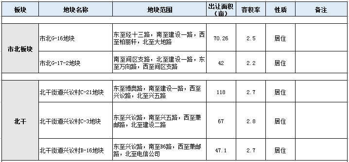
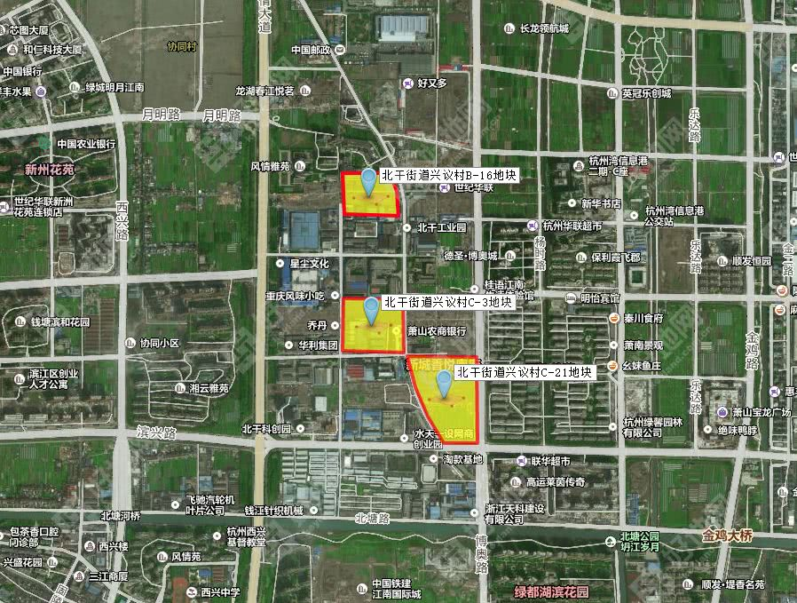

# TrackHouse

A plan for tracking new houses in Xiaoshan District , Hangzhou City .

首先是萧山区整体土地出让相关

[萧山区有哪些好地即将推出？今天，39家房企现场考察](http://www.jinciwei.cn/i33138.html)

[政府公告(文件大小22M)](docs/关于印发《2018年萧山区经营性用地三个计划》的通知.pdf)

从里面找到，信息港周边的地块如下：

* 市北板块的两个地块，距离铁路太近
* 北干的三个地块，都是兴议村地块，距离信息港很近，交通/配套都不错

|板块 | 地块 | 聚合信息 |
|- | :-: | :-: |
|北干街道 | 兴议村C-21地块  |   [房天下-市北西单元兴议村C-21地块](http://land.3fang.com/market/144950f5-66e6-43cc-be35-8144340474e7.html)|
||| [浙报传媒-市北西单元兴议村C-21地块](http://land.zzhz.zjol.com.cn/land/14920.html)|
|北干街道 | 兴议村C-3地块  |  |
|北干街道 | 兴议村B-16地块  |  |